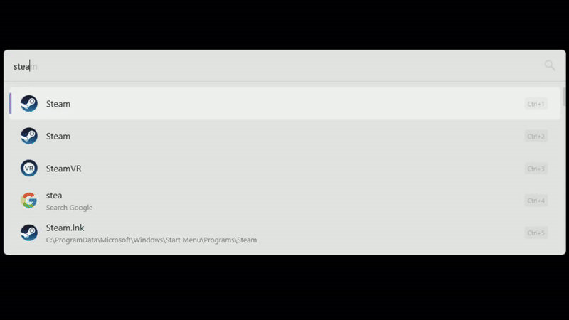

## SteamFlow
search Steam store and launch games

## Features:
- 🔍 Search and launch installed Steam games
- 🛒 Search the Steam store and open game pages in the Steam client
- 🎮 Launch games directly from Flow Launcher

## TODO:
- [x] Regional pricing support
- [x] Show current number of active players
- [x] Async requests
- [ ] Show installed game icons

## Installation:
type `pm install SteamFlow by keekys`in FlowLauncher

or

Unzip [archive](https://github.com/keekyslusus/SteamFlow/releases/latest) to `%appdata%\FlowLauncher\Plugins`
