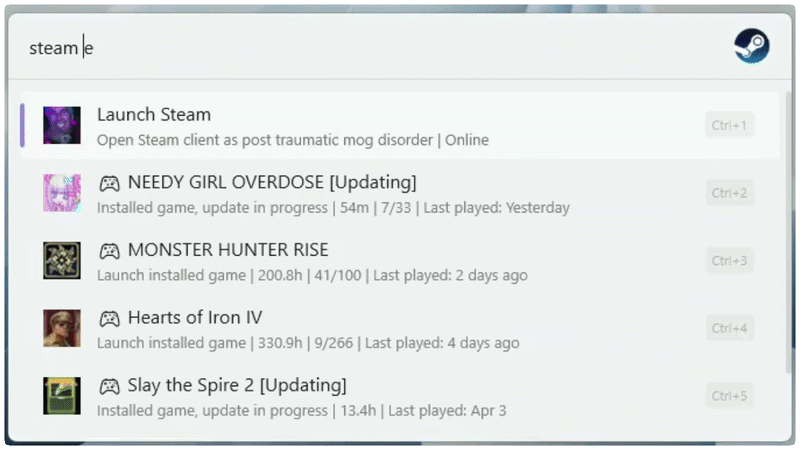
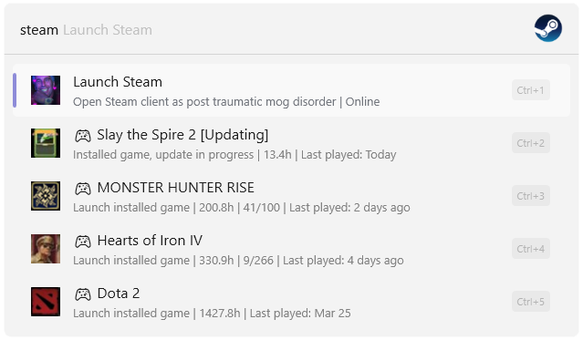
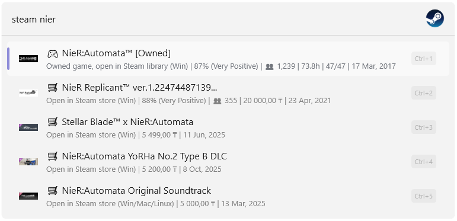
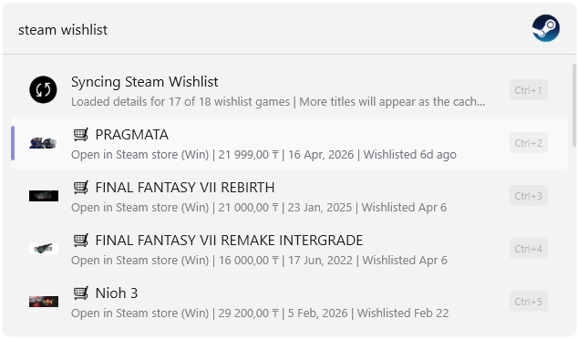
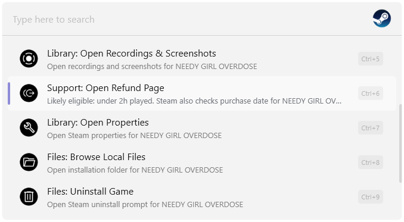
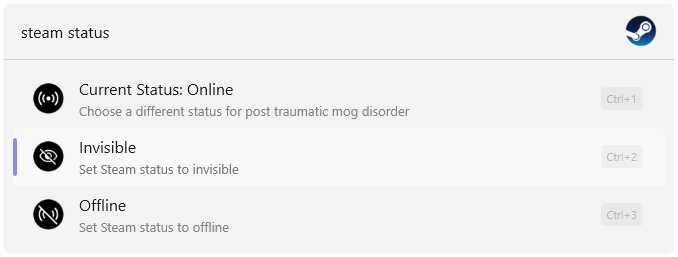
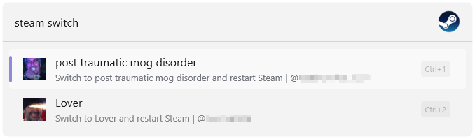

  <picture>
    <source media="(prefers-color-scheme: dark)" srcset=".github/readme_for_dark_theme.svg">
    <source media="(prefers-color-scheme: light)" srcset=".github/readme_for_light_theme.svg">
    
  </picture>

  
  
  
  

## SteamFlow: steam plugin for [Flow Launcher](https://www.flowlauncher.com/)

### Search Steam store and launch games and more

### Commands

`steam ?`
`steam api`
`steam status`
`steam switch`
`steam wishlist`

## Features

### Local library

- Launch installed games directly from Flow Launcher
- Shows playtime, last played date, and achievement progress
- Live install/update status badges
- Sorted by most recently played

### Steam Store search

- Search the Steam store by game name
- Shows review score, concurrent player count, price, and release date
- Owned games opens directly in your library

### Wishlist

- Browse and search your Steam wishlist
- Shows current price, review score, and date added to wishlist
- Requires a Steam Web API key (`steam api` to configure)

### Adaptive context menu

- Open store page in Steam or [SteamDB](https://steamdb.info/)
- Open Community Guides and Discussions
- Open Recordings & Screenshots folder
- Open game Properties
- Browse local game files
- Check refund eligibility
- Install or Uninstall game

### Steam status

- Switch to Online, Invisible, or Offline in one click

### Account switcher

- Switch between Steam accounts signed in on this PC and restart Steam instantly

### Steam Web API

> API key is encrypted with Windows DPAPI and bound to your Steam account.

- Detects owned games from store search
- Enables wishlist browsing
- Shows your active profile status (Online, playing a game, etc.)

## TODO:

- Pause/resume download/update for installing/updating games using Remote access [(`IClientCommService`)](docs/clientcomm.md)
- `Add to Google Calendar` context menu option in `steam wishlist` for upcoming games with a known release date
- `steam recent` with `IPlayerService/GetRecentlyPlayedGames` under discussion
- Commands to display the `New & trending`, `Top sellers` and `Specials` lists

## Installation
type `pm install SteamFlow by keekys`in FlowLauncher

or

Unzip [archive](https://github.com/keekyslusus/SteamFlow/releases/latest) to `%appdata%\FlowLauncher\Plugins`
