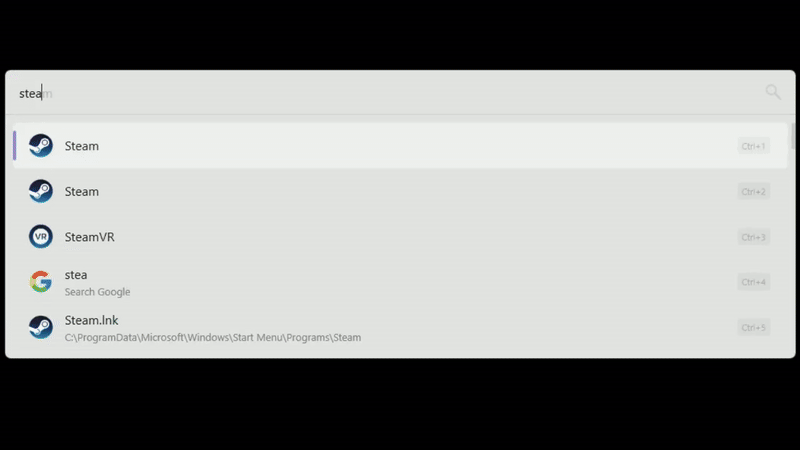

## SteamFlow
search Steam store and launch games

## Features:
- Launch Steam and installed Steam games directly from Flow Launcher
- Search the Steam store with regional prices and current player counts
- Open Steam Store, [SteamDB](https://steamdb.info), or local game files from the context menu

## TODO:
- [x] Regional pricing support
- [x] Show current number of active players
- [x] Async requests
- [x] Show installed game icons
- [x] [Show all installed games with empty search](https://github.com/keekyslusus/SteamFlow/issues/2)
- [x] Context menu

## Installation:
type `pm install SteamFlow by keekys`in FlowLauncher

or

Unzip [archive](https://github.com/keekyslusus/SteamFlow/releases/latest) to `%appdata%\FlowLauncher\Plugins`
